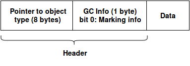

Object layout
============
The following object layout is used:

All pointers to an object _should_ be to data part, not the header. All instructions also expects that the pointer is to data part. Any modification to an object reference should be made through the `ObjectRef` class ([link](../src/type/objectref.h))

## Class
The layout of the class is the same order as the fields are defined. Any modification to a class (such as changing the field) reference should be made through the `ClassRef` class ([link](../src/type/objectref.h))

## Arrays
The first 4 bytes are always the length of the array. This is followed by the elements of the array. Any modification to an array (such as changing the elements) reference should be made through the `ArrayRef` class ([link](../src/type/objectref.h))
